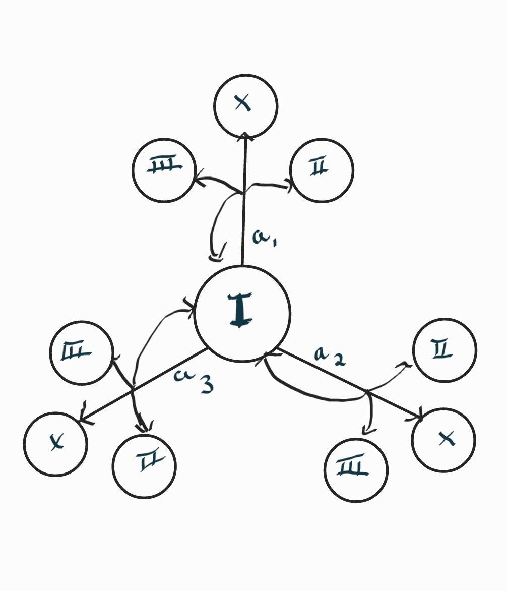
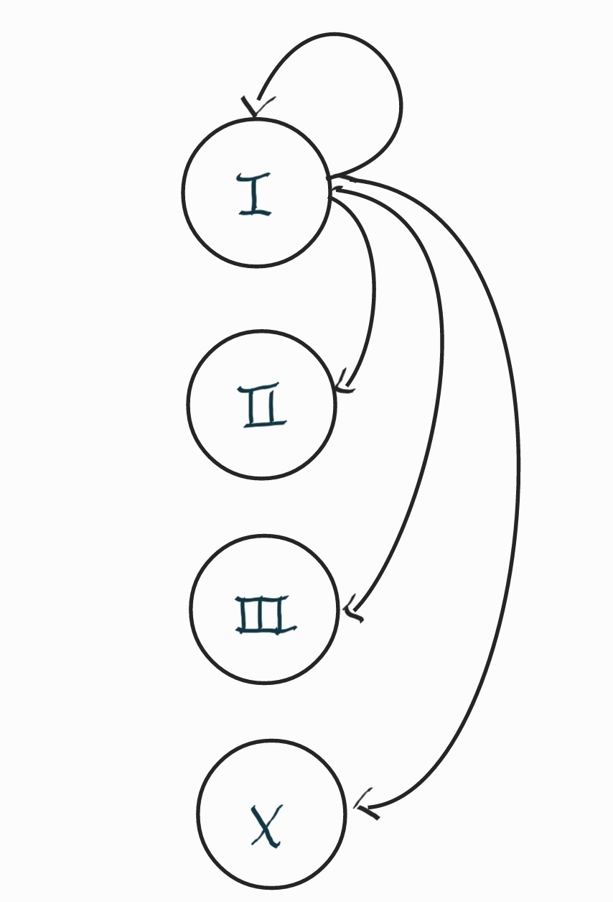
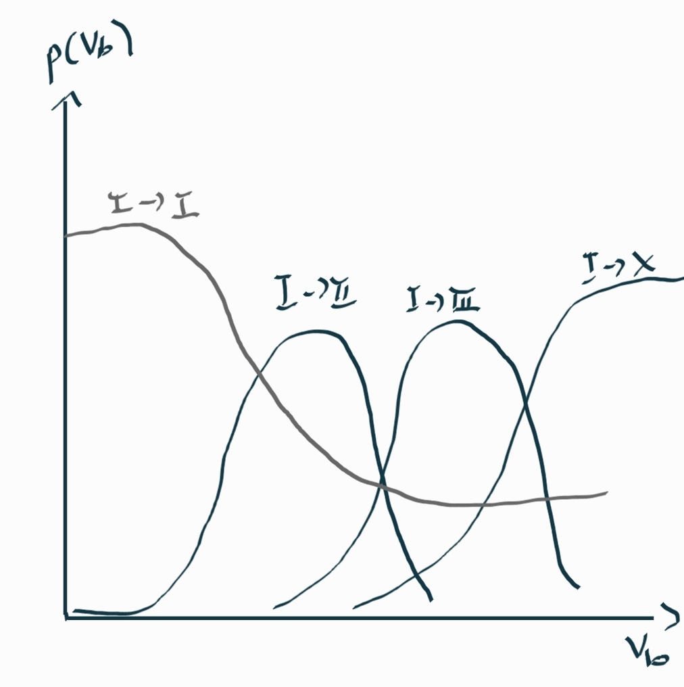

### Overview
This aim of the project is to optimize electroforming testing for nanodevices (memristors) using Reinforcement Learning.  

### Main tasks:	 

- First build a toy model so that we gather as much information from the tests on the model.  

- List all the parameters that are going to be used. These are the input and output parameters (possibly include system hyperparameters as well).   

- Perform compliance testing on a number of selected solutions (main target: RL set-ups; other possibilities: standard ANNs or rules-based approaches).  

- Assess whether toy model has enough discriminatory capability to distinguish between the different outcomes taking into consideration the input parameters 

- Once the toy model works in simulation, transfer & test on real devices and observe.  

- Launch a downloadable module available for community to use. 

### Progress

#### Allstates: 
Consists of all state transition models. Makes use of gaussian probablity distribution and sigma probablity distribution 
#### State transitions
In this case the model is a probabilistic model which means each state transitions are represented in probabilistic form; the likelihood the DUT goes from a given state it to any other state or stays in the same state. No real data is collected of how this probability state transitions will look like. Hence, begin defining these probability state transitions by taking into account  of what is known at the moment of definition and making reasonable assumptions.   
Having a function for every voltage below is a general idea of how the probability of transition will look like.

#### Assumptions 

1. The electroforming probabilities characteristics in real hardware does not change over time on a single device  
2. The electroforming probabilities characteristics will change with the physical series resistor
3. To go to higher resistance state requires a positive voltage
4. To go to lower resistance state requires a negative voltage
5. Applying no voltage(0V) to the device results in no change in the device
6. The chances of a device failing increases with voltage
7. The probability transitions are modelled to follow a gaussian distribution except the transition to a failed state or when it is remaining in the same state
8. The Vmax is set to 5V and Vmin is -5V. Applying a voltage ranging between these two value is resonable enough for electroforming 

#### MDP: 
By taking the one state stransition model i.e (state I), Markov decision process is applyed to determine the next state for a given applied voltage. it returns next state with the probablity.

{hight=200 width=200}

{hight=200 width=200}
{hight=200 width=200}